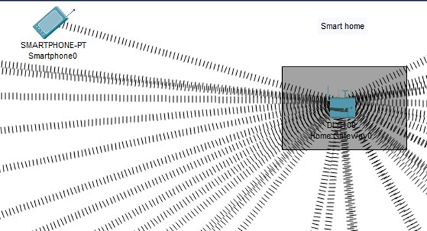
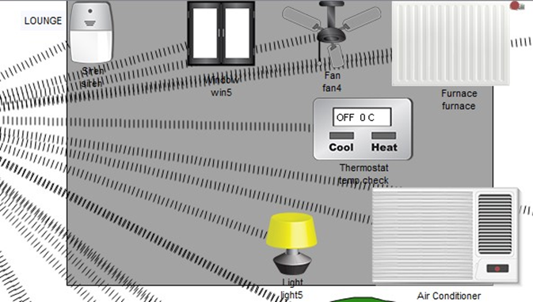
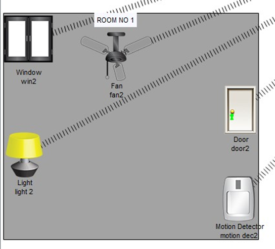
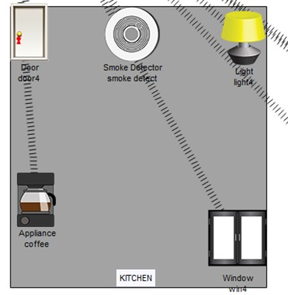
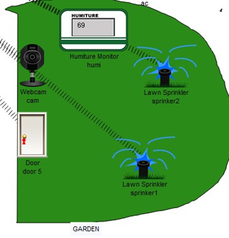
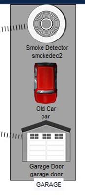

# Smart Home Automation (Cisco Packet Tracer) - 2024

**Course:** Computer Networks  
**Project:** Smart Home Network Simulation

## Contributors
- Muhammad Haroon Azhar
- Adnan Ahmed
- Muhammad Imtisaal
- Muhammad Obaid

## Table of Contents
- [Introduction](#introduction)
- [Purpose](#purpose)
- [Tools Used](#tools-used)
- [Devices](#devices)
- [Control Device](#control-device)
- [Lounge](#lounge)
- [Rooms](#rooms)
- [Kitchen](#kitchen)
- [Garden](#garden)
- [Garage](#garage)
- [Cost Breakdown](#cost-breakdown)
- [Conclusion](#conclusion)

## Introduction
In our Cisco Packet Tracer smart home project, we've simulated a network comprising routers and IoT devices such as smart lights and security cameras. Our focus includes designing automation scenarios for efficient device control, implementing security measures, and emphasizing troubleshooting and simulation for a complete smart home system within the Packet Tracer environment.

## Purpose
The purpose of the smart home project in Cisco Packet Tracer is to provide a hands-on simulation environment for learning and experimenting with networking and Internet of Things (IoT) concepts. This project allows users to explore the integration of various devices and routers within a home network, design automation scenarios, implement security measures, and gain practical experience in troubleshooting and network documentation. It serves as a valuable educational tool for understanding the complexities and functionalities of smart home systems in a controlled, virtual environment.

## Tools Used
- Cisco Packet Tracer
- Computer
- Laptop

## Devices
We created a smart home system which is connected wirelessly with a Home Gateway router and a smartphone. You can control everything with your smartphone. All smart home devices have Wi‑Fi adapters and are connected wirelessly with the router and smartphone.

- All devices are connected wirelessly.
- All devices share a single network.

## Control Device

- Smartphone
- Home Gateway Router

## Lounge

In the lounge we have several devices:
- Window
- Fan
- Lights
- Air Conditioner
- Furnace
- Siren (reacts to smoke detection)
- Temperature check system
- Doors

## Rooms

In the rooms of the smart home, we have:
- Window
- Lights
- Fan
- Door
- Motion detection

## Kitchen

In the kitchen we have:
- Lights
- Kitchen appliances
- Coffee maker and other devices
- Window
- Smoke detection

## Garden

In the garden we have:
- Camera (for security)
- Door
- Lawn sprinklers
- Humiture monitor (for sprinklers)

## Garage

In the garage we have:
- Smoke detection
- Car
- Garage door

## Cost Breakdown
| Serial # | Product          | Quantity | Price        | Subtotal        |
|---------:|------------------|---------:|--------------|-----------------|
| 1        | USR IoT gateway (as listed) | 1 | 36,500 PKR | 36,500 PKR |
| 2        | Smart bulb       | 5        | 1,250 PKR    | 6,250 PKR       |
| 3        | Smart fan        | 4        | 17,000 PKR   | 68,000 PKR      |
| 4        | Motion sensor    | 4        | 3,850 PKR    | 15,400 PKR      |
| 5        | Smoke sensor     | 2        | 3,000 PKR    | 6,000 PKR       |
|          | **Total**        |          |              | **132,000 PKR** |

## Conclusion
In this semester project, we gained knowledge and a better understanding of Cisco Packet Tracer software where we simulate networks. We learned that we can build an entire smart home network, connect all devices to a router, and control them with a smartphone. This helped us gain better knowledge and understanding of networking and Cisco Packet Tracer. This concludes this semester project.
